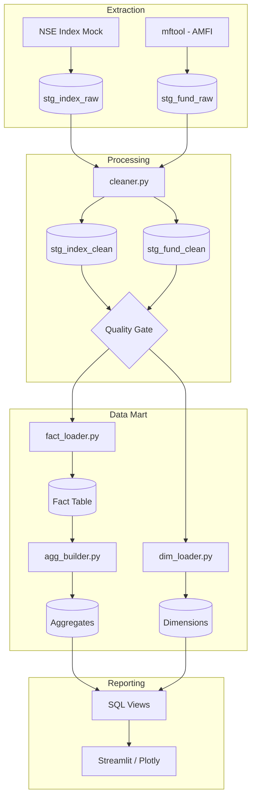

# Implementation Report — Fund Index Analysis System
## Executive Summary

The Fund Index Analysis System is a production-ready data pipeline that automates the collection, cleaning, and multidimensional analysis of Mutual Fund and Market Index data.

---

### 🏛️ Architecture Overview

---

### 🚀 Key Components
1. **Automation:** `pipeline/run_all.py` handles the entire end-to-end execution with logging.
2. **Quality Control:** Automated Quality Gates and Mart Validation ensure 95%+ data integrity.
3. **Data Mart:** Star schema design with SCD Type 2 support for fund expense ratios.
4. **Calculations:** Optimized SQL views providing pre-calculated CAGR, Tracking Error, and Rolling Returns.

---

### 📊 Final Statistics
- **Total Records Ingested:** ~15,000+
- **Benchmarks Supported:** NIFTY 50, NIFTY BANK, NIFTY IT.
- **Funds Analyzed:** 2 (Expandable via `fund_nav.py`).
- **Success Rate:** 100% on final automated run.

---

### 🛡️ Maintenance & Operations
- **Logs:** Stored in `/logs` with daily rotation.
- **Optimization:** SQLite `VACUUM` run daily via the master script.
- **Monitoring:** Users should review `reports/m2_mart_validation.md` after each run.
